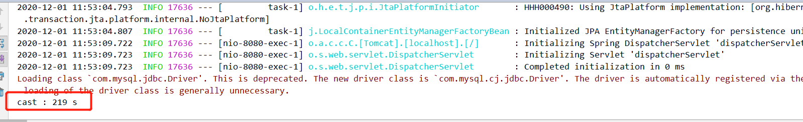

### Week07 作业题目必做一：按自己设计的表结构，插入 100 万订单模拟数据，测试不同方式的插入效率
```java
   /**
     * 使用动态拼接SQL方式插入100万条数据测试
     *
     * @author chentz
     * @date 2020/12/1 10:45
     * @param
     * @return void
     */
    public void insertByDynamicSql() {
        Connection conn = getConnection();
        // 开时时间
        Long begin = new Date().getTime();
        // sql前缀
        String prefix = "INSERT INTO tb_order (order_no, user_id, address, mobile, product_code, price, product_quantity, order_amount," +
                "status, create_time, update_time, delete_sign) VALUES ";
        try {
            // 保存sql后缀
            StringBuffer suffix = new StringBuffer();
            // 设置事务为非自动提交
            conn.setAutoCommit(false);
            PreparedStatement pst = conn.prepareStatement("");
            // 外层循环，总提交事务次数
            for (int i = 1; i <= 100; i++) {
                for (int j = 1; j <= 10000; j++) {
                    // 构建sql后缀
                    suffix.append("(" + SnowflakeIdUtil.getIdUtilNo() + "," + SnowflakeIdUtil.getIdUtilNo() + "," + "'test'," +
                            "'18120868629'," + SnowflakeIdUtil.getIdUtilNo() + "," + 0.01 + "," + 1 + "," + 0.01 + ","
                            + 1 + "," + new Date().getTime() + "," + new Date().getTime() + "," + 0 + "),");
                }
                // 构建完整sql
                String sql = prefix + suffix.substring(0, suffix.length() - 1);
                // 添加执行sql
                pst.addBatch(sql);
                // 执行操作
                pst.executeBatch();
                // 提交事务
                conn.commit();
                // 清空上一次添加的数据
                suffix = new StringBuffer();
            }
            pst.close();
            conn.close();
        } catch (SQLException e) {
            e.printStackTrace();
        }
        // 结束时间
        Long end = new Date().getTime();
        // 耗时
        System.out.println("cast : " + (end - begin) / 1000 + " s");
    }
```

```java
     /**
     * 每条insert单独执行
     *
     * @author chentz
     * @date 2020/12/1 11:56
     * @param
     * @return void
     */
    public void insertPerSql() {
        Long begin = new Date().getTime();
        Connection conn = getConnection();
        try {
            for (int i = 1; i <= 1000000; i++) {
                String sql = "INSERT INTO tb_order (order_no, user_id, address, mobile, product_code, price, product_quantity, order_amount," +
                        "status, create_time, update_time, delete_sign) VALUES(?,?,?,?,?,?,?,?,?,?,?,?)";
                PreparedStatement ps = conn.prepareStatement(sql);
                ps.setLong(1, SnowflakeIdUtil.getIdUtilNo());
                ps.setLong(2, SnowflakeIdUtil.getIdUtilNo());
                ps.setString(3, "测试地址");
                ps.setString(4, "18120868629");
                ps.setLong(5, SnowflakeIdUtil.getIdUtilNo());
                ps.setBigDecimal(6, new BigDecimal("0.01"));
                ps.setInt(7, 1);
                ps.setBigDecimal(8, new BigDecimal("0.01"));
                ps.setByte(9, (byte)1);
                ps.setLong(10, new Date().getTime());
                ps.setLong(11, new Date().getTime());
                ps.setByte(12, (byte)0);
                ps.executeUpdate();
            }
        } catch (Exception e) {
            e.printStackTrace();
        } finally {
            if (conn != null) {
                // 关闭连接
                try {
                    conn.close();
                } catch (Exception e) {
                    e.printStackTrace();
                }
            }
        }
        Long end = new Date().getTime();
        System.out.println("cast : " + (end - begin) / 1000 + " s");
    }
```
该方式耗时太久了，所以就没等结果了~~~~

### Week07 作业题目必做二：读写分离 - 动态切换数据源版本 1.0
- 基于注解的方式动态实现数据源的切换：https://github.com/tianzhuchen1988/JAVA-000/tree/main/Week_07/mysql-proxy-demo
```java
@RestController
@RequestMapping("/test")
public class UserController {

    @Resource
    private IUserService iUserService;

    @GetMapping("/master")
    @TargetDataSource("master")
    public List<User> listByMaster() throws Exception {
        return iUserService.list();
    }

    @GetMapping("/slave")
    @TargetDataSource("slave")
    public List<User> listBySlave() throws Exception {
        return iUserService.list();
    }
}
```
### Week07 作业题目必做三：读写分离 - 数据库框架版本 2.0
- 基于springboot2.1.1+mybatis+sharding-jdbc3.1.0实现读写分离: https://github.com/tianzhuchen1988/JAVA-000/tree/main/Week_07/shardingsphere-jdbc-demo
- 配置了2个dataSource: db-test0,db-test1
- 写走db-test0, 读走db-test1
